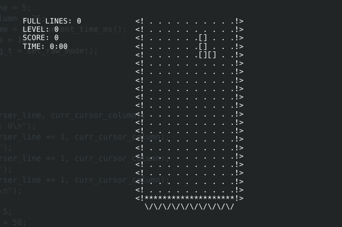
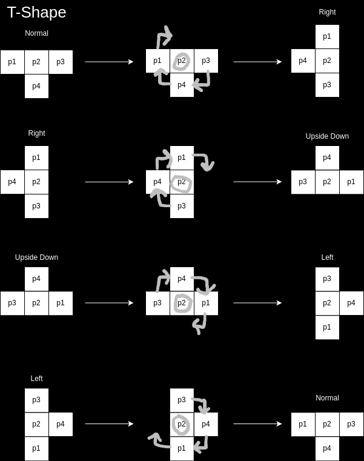

# Tetris Mini

This folder contains the source code for the Tetris Mini game that is on my _LameBoy™_.  

## UI

### Shapes
This tetris game will only be the most basic implementation with the following shapes (aka Tetrominoes):
1. O
    ```
    [][]
    [][]
    ```
2. I
    ```
    []
    []
    []
    []
    ```
3. S
    ```
      [][]
    [][]
    ```
4. Z
    ```
    [][]
      [][]
    ```
5. L
    ```
    [] 
    []
    [][]
    ```
6. J
    ```
      []
      []
    [][]
    ```
7. T
    ```
    [][][]
      []
    ```

Each of the pieces that make up a shape (`[]`) are referred to in the code as `PIECE`.  

### Board Layout
The playable board will be 10 pieces wide by 20 pieces tall and will look like this:
```
<! . . . . . . . . . .!>
<! . . . . . . . . . .!>
<! . . . . . . . . . .!>
<! . . . . . . . . . .!>
<! . . . . . . . . . .!>
<! . . . . . . . . . .!>
<! . . . . . . . . . .!>
<! . . . . . . . . . .!>
<! . . . . . . . . . .!>
<! . . . . . . . . . .!>
<! . . . . . . . . . .!>
<! . . . . . . . . . .!>
<! . . . . . . . . . .!>
<! . . . . . . . . . .!>
<! . . . . . . . . . .!>
<! . . . . . . . . . .!>
<! . . . . . . . . . .!>
<! . . . . . . . . . .!>
<! . . . . . . . . . .!>
<! . . . . . . . . . .!>
<!********************!>
  \/\/\/\/\/\/\/\/\/\/
```

The stats being tracked during the game are as follows:
- `FULL LINES`: Total count of the horizontal rows you have completed.
- `LEVEL`: The current game speed (typically increases every 10 levels cleared). Increases gravity and points per line cleared.
- `SCORE`: Each piece starts with 19 potential points and decreases by 1 as it moves down.
- `TIME`: Duration of current play session.
- `BEST LINES`: Highest number of lines cleared in a single session played on the machine.

The UI will look like the original Tetris by Alexey Pajitnov on the Electronika 60:
  

A first draft version of `Tetris Mini` looks like this:
My version will looks something like this:  
  

## Game Logic
This section will explain the logic needed for this game to function. Ranging from the terminal drawing library, game rendering, game state management, user inputs, piece movement, etc.

### Game State
The game state is represented by the `GameState_t` struct. It is the 'brain' behind managing the current status of the game including the board state (which is used for rendering and collisions), and the score trackers (mentioned in the [UI](#ui) section)

#### `bitboard`
The board will be represented as an array of unsigned integers with a bit field of 10 (meaning only 10 bits will be used). I will refer to it as a `bitboard`.  

I know of this method due to previous interest in building/training chess engines which will refer to the chess board as a 64-bit unsigned integer as it is the most efficient way to represent many positions on a chess board to avoid multi-dimensional arrays.  

Representing the board like this makes the update operations faster as I am able to represent the `PIECE` on the board as a 1, and any empty positions as a 0.

Think of the board as a series of coordinates:
| 0,0 | 1,0 | 2,0 | 3,0 | 4,0 | 5,0 | 6,0 | 7,0 | 8,0 | 9,0 |
| :---: | :---: | :---: | :---: | :---: | :---: | :---: | :---: | :---: | :---: |
| 0,1 | 1,1 | 2,1 | 3,1 | 4,1 | 5,1 | 6,1 | 7,1 | 8,1 | 9,1 |
| 0,2 | 1,2 | 2,2 | 3,2 | 4,2 | 5,2 | 6,2 | 7,2 | 8,2 | 9,2 |
| . | . | . | . | . | . | . | . | . | . |
| 0,9 | 1,9 | 2,9 | 3,9 | 4,9 | 5,9 | 6,9 | 7,9 | 8,9 | 9,9 |

These coordinates will be translated to the bit position within the bit strings of the bitboard. The operation to perform this is a simple XOR of the desired bit to be flipped in the bitboard.  

For example, if a `PIECE` is at the coordinate of (3,0), the equation to flip the corresponding bit would be `bitboard[y].value ^= (1 << x);`, where `x` = 3 and `y` = 0. THe implementation of this is in the `flip_bit` function. This method provides an easy, efficient way to manage the state of the game without requiring significant compute time (perfect for a microcontroller or microprocessor).

#### `active_piece`

This attribute of the game state will track the current piece the user is controlling. It is a custom struct called `Tetromino_t` that has the following definition:
```c
typedef struct
{
    Shape_t type;
    coords_t coords;
    coords_t prev_coords;
    Rotations_t rotation_state;
    int height;
    int width;
} Tetromino_t;
```
##### `type` 
An enum of the current shape type called `Shape_t`;
```c
typedef enum Shape
{
    O_SHAPE,
    I_SHAPE,
    S_SHAPE,
    Z_SHAPE,
    L_SHAPE,
    J_SHAPE,
    T_SHAPE
} Shape_t;
```
##### `coord` 
The current coordinates of the Tetromino represented by `coords_t` which is a struct representing the coordinates of each `PIECE` of the shape (every shape has 4 pieces  i.e. 4 coords, where each coord (p1, p2, p3, p4) is an x and y integer represented by `coord_t`);
```c
typedef struct
{
    coord_t p1;
    coord_t p2;
    coord_t p3;
    coord_t p4;
} coords_t;

typedef struct
{
    int x;
    int y;
} coord_t;
```
##### `prev_coords` 
The same as `coords` but saves the last position of the Tetromino in order to more easily 'erase' and 'redraw' the shapes without needing to undo the transition applied to the coordinates in the first place.  

##### `rotation_state`
An enum of the current rotated state that the Teromino is in. The definition is as follows;
```c
typedef enum 
{
    NORMAL,
    LEFT,
    RIGHT,
    UPSIDE_DOWN
} Rotations_t;
```

##### `height`
The height of the Tetromino as an integer

##### `width`
The width of the Tetromino as an integer.

#### `lines_completed`
This is an `int` which tracks the number of lines that have been completed per the metric in [Board Layout](#board-layout)

#### `game_time`
This is a `time_t` type variable which tracks the duration of the session per the metric in [Board Layout](#board-layout)

#### `level`
This is an `int` which tracks the current level the user is on per the metric in [Board Layout](#board-layout)

#### `score`
This is an `int` which tracks the users current score per the metric in [Board Layout](#board-layout)

### User Input (Moving Tetrominos)
The Tetrominos will spawn at the top of the game board and will move 1 piece down every 1 second (gravity).  

Each Tetromino can be moved [Left](#left), [Right](#right), [Down](#down), or [Rotated](#rotate).   

#### Left
The user can move a Tetromino to the left by pressing the `a` key as long as it is within the leftmost wall.
- Moving Left will decrease the X coordinates of the Tetromino by 1

#### Right
The user can move a Tetromino to the right by pressing the `d` key as long as it is within the rightmost wall.
- Moving Right will increase the X coordinates of the Tetromino by 1

#### Down
The user can move a Tetromino down by pressing the `s` key as long as it is above the bottom wall.
- Moving down will increase the Y coordinates by 1 (separate from gravity).

#### Rotate
The user can rotate a piece by pressing the `w` key as long as the 4 coordinates of the piece remain in the game board boundaries after the rotation.
- Rotating will transition the Tetromino into 1 of 4 positions:
    1. NORMAL
    2. RIGHT
    3. LEFT
    4. UPSIDE_DOWN

##### Rotation
Rotating will be handled by rotating a Tetromino using its `p2` as the focal point.  

As mentioned in [coord](#coord), the Tetrominos consist of 4 coordinates, `p1`, `p2`, `p3`, and `p4`. 

T-Shape will be rotated as such:  


### Collisions